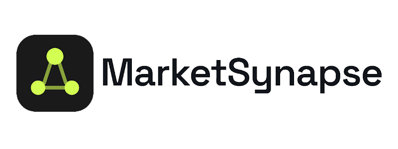

<div align="center">
  
  
  #
   
  <p><b>Real-Time Financial Intelligence Combining News Sentiment, Price Action & AI-Generated Market Briefs</b></p>
 


<br>

Built with the tools and technologies:  


</div>

---

## 🧠 Project Summary

**MarketSynapse** is a real-time financial intelligence platform that combines live news sentiment, price movement, and an AI-generated market brief into a single view. It runs a self-correcting LangGraph agent that drafts, reviews, and revises its own analysis before showing it to the user, and persists every result so sentiment trends can be tracked over time.

Enter a ticker and MarketSynapse:
1. Pulls recent news, filtered for actual relevance to that company
2. Scores sentiment with **FinBERT**, a finance-domain sentiment model
3. Pulls price history via **yfinance**
4. Correlates the two into an **alignment verdict** — did sentiment match price, or diverge?
5. Runs a 3-node **LangGraph** agent that writes a plain-English brief, then reviews and self-corrects its own draft
6. Persists the result so sentiment trends are visible over time

See the in-app **"How it works"** page for a full pipeline diagram and an honest list of known limitations.

---

## 🚀 Features

- 🔍 **Single-Ticker Analysis** — price, sentiment, alignment verdict, AI brief, and headline list in one view
- ⚖️ **Compare Mode** — two tickers side-by-side with a comparative AI brief
- 📊 **Sentiment Trend Chart** — historical sentiment pulled from a local SQLite log
- 📡 **Market Pulse** — live snapshot of major tickers shown before you've searched anything
- ⭐ **Watchlist** — save tickers for quick access
- 📤 **Export** — copy the brief or print/save as PDF
- 🌓 **Dark/Light Theme** — with system-preference detection
- 🔎 **Zoomable Charts** — drag to zoom into any date range on price/sentiment charts
- 🤖 **Self-Correcting AI Agent** — a review node checks and revises the brief before it's shown
- 🕵️ **Relevance-Filtered News** — articles are filtered so only genuinely relevant coverage reaches sentiment scoring

---

## 🗃️ Project Structure

```bash
marketsynapse/
├── backend/
│   ├── main.py                    # FastAPI app entry point, CORS, router registration
│   ├── config.py                  # pydantic-settings, loads .env
│   ├── routers/
│   │   ├── news.py                # GET /news/{ticker}
│   │   ├── stock.py                # GET /stock/{ticker}
│   │   ├── correlation.py          # GET /analyze/{ticker}
│   │   ├── brief.py                # GET /brief/{ticker}
│   │   ├── report.py               # GET /report/{ticker}  <- unified endpoint
│   │   ├── history.py              # GET /history/{ticker}
│   │   ├── compare.py              # GET /compare?tickers=AAPL,MSFT
│   │   └── watchlist.py            # GET/POST/DELETE /watchlist
│   ├── services/
│   │   ├── news_service.py         # NewsAPI integration + relevance filtering
│   │   ├── sentiment_service.py    # FinBERT sentiment analysis
│   │   ├── stock_service.py        # yfinance price data
│   │   ├── correlation_service.py  # combines sentiment + price, caches, logs history
│   │   ├── agent_service.py        # LangGraph agent: extract_facts -> write_brief -> review_brief
│   │   ├── comparison_service.py   # multi-ticker comparison agent
│   │   ├── history_service.py      # persists + retrieves sentiment snapshots
│   │   └── cache_service.py        # in-memory TTL cache (5 min default)
│   ├── models/schemas.py
│   └── database/
│       ├── db.py                   # SQLAlchemy engine/session
│       └── models.py               # SentimentHistory table
├── frontend/
│   ├── src/
│   │   ├── App.jsx
│   │   ├── services/api.js
│   │   ├── utils/marketStatus.js   # market open/closed check, DST-safe
│   │   └── components/
│   │       ├── Logo.jsx
│   │       ├── Footer.jsx
│   │       ├── HowItWorks.jsx      # architecture page with animated diagrams
│   │       ├── PricePanel.jsx
│   │       ├── SignalReadout.jsx
│   │       ├── SentimentTrendChart.jsx
│   │       ├── CompareView.jsx
│   │       ├── MarketPulse.jsx     # live ticker strip shown on empty state
│   │       ├── Watchlist.jsx
│   │       ├── BriefCard.jsx
│   │       ├── ArticleList.jsx
│   │       ├── RecentSearches.jsx
│   │       ├── MarketStatusBadge.jsx
│   │       ├── LastUpdated.jsx
│   │       ├── Disclaimer.jsx
│   │       ├── EmptyState.jsx
│   │       ├── LoadingState.jsx
│   │       └── ThemeToggle.jsx
│   └── vite.config.js              # includes @tailwindcss/vite plugin
├── tests/
│   ├── test_news_service.py
│   ├── test_correlation_service.py
│   ├── test_stock_service.py
│   └── eval_brief.py               # rubric-scored eval harness for LLM briefs
├── requirements.txt
├── .env.example
├── README.md
├── LICENSE
└── .gitignore
```

---

## 🔧 Setup & Installation

> Make sure **Python 3.9+** and **Node.js** with **npm** are installed on your system.

### ⚙️ Backend

```bash
# Clone the repo
git clone https://github.com/Muhammad-Ahmed-Rayyan/MarketSynapse.git
cd MarketSynapse

# Create and activate a virtual environment
python3 -m venv venv
source venv/bin/activate      # Windows: venv\Scripts\activate

# Install dependencies
pip install -r requirements.txt

# Configure environment variables
cp .env.example .env
# Add your NEWS_API_KEY (newsapi.org) and GROQ_API_KEY (console.groq.com)

# Run the backend
uvicorn backend.main:app --reload
```

### 💻 Frontend

```bash
# In a separate terminal
cd frontend

# Install dependencies
npm install

# Create frontend/.env with: VITE_API_URL=http://localhost:8000

# Run the development server
npm run dev
```

> Both servers must run simultaneously. `.env` files are gitignored — each person running this needs their own free API keys.

> **Windows note:** if `npm install` fails with a native-binding error (`rolldown-binding... not a valid Win32 application`), it's a known npm bug (npm/cli#4828) — delete `node_modules/` and `package-lock.json`, run `npm cache clean --force`, then reinstall.

---

## 🔑 API Configuration

MarketSynapse requires API keys for **NewsAPI** and **Groq**. Update the backend `.env` file with your own credentials:

```.env
NEWS_API_KEY="YOUR-NEWSAPI-KEY"
GROQ_API_KEY="YOUR-GROQ-API-KEY"
```

You can obtain these values from:

- **NewsAPI:** Sign up at [newsapi.org](https://newsapi.org) to get a free API key.
- **Groq:** Visit [console.groq.com](https://console.groq.com) to generate your API key (used for the `llama-3.1-8b-instant` model).

The frontend also needs its own `.env`:

```.env
VITE_API_URL="http://localhost:8000"
```

---

## 📚 API Endpoints

| Endpoint | Returns |
|---|---|
| `GET /news/{ticker}` | Relevance-filtered recent articles |
| `GET /stock/{ticker}` | Price history + % change |
| `GET /analyze/{ticker}` | Sentiment + price combined, with `alignment` verdict |
| `GET /brief/{ticker}` | AI-generated market brief |
| `GET /report/{ticker}` | Unified endpoint — everything above in one call (used by the frontend) |
| `GET /history/{ticker}` | Historical sentiment snapshots |
| `GET /compare?tickers=A,B` | Side-by-side comparison of two tickers |
| `GET/POST/DELETE /watchlist` | Manage saved tickers |
| `GET /health` | Health check |

> All ticker endpoints accept an optional `days_back` parameter.

---

## 🧪 Testing

```bash
pytest tests/ -v

# Rubric-scored eval for the LLM brief (costs Groq API calls)
python tests/eval_brief.py
```

---

## ⚠️ Known Limitations

- **NewsAPI free tier:** 100 requests/day, articles limited to the past month.
- **yfinance** is an unofficial Yahoo Finance scraper — occasional transient failures are expected, and NaN price rows (e.g. on days markets are closed) are filtered out before analysis.
- **FinBERT** can misread routine corporate language (e.g. a neutral dividend announcement) as negative.
- The self-correction agent node reliably catches explicit investment advice but is less reliable at catching subtler hallucinated details — a documented capability limit of the small, fast model used (`llama-3.1-8b-instant`), not an unfixed bug.
- The eval harness uses substring/keyword checks, not semantic verification.
- In-memory cache and recent-search history reset on server/page restart — intentional for this phase, not an oversight.

---

<div align="center">

⭐ Found this project useful? Drop a star on GitHub!

</div>